# Agentic Architecture V2 - Tool-Based Data Scientist Agent

**Created**: January 12, 2026  
**Status**: Proposed  
**Version**: 2.0 (Replaces Node-Based Architecture)

---

## Overview

This document describes a modern agentic architecture for the AI Data Scientist, replacing the rigid node-based graph with a flexible tool-based approach. The agent uses **ReAct-style reasoning** (Reasoning + Acting) where a single LLM dynamically decides which tools to use based on the task at hand.

### Key Changes from V1

| Aspect | V1 (Node-Based) | V2 (Tool-Based) |
|--------|-----------------|-----------------|
| Flow control | Fixed graph (Node 0→1B→2→3→4→5→6) | LLM decides dynamically |
| Classification | Rigid taxonomy (7 analysis_types) | Free-form reasoning |
| Knowledge | Encoded in prompts | Retrieved from example library |
| Validation | Separate evaluation node | Integrated reflection loop |
| Complexity | 7+ nodes with routing logic | 1 agent + 5 tools |

---

## Architecture Diagram


---

## Agent Loop

The agent operates in a **ReAct loop** - it reasons about what to do, takes an action (tool call), observes the result, and repeats until the task is complete.

```mermaid
flowchart LR
    subgraph LOOP["Agent Loop"]
        OBSERVE["👁️ Observe<br/>(context, tool results)"]
        THINK["🧠 Think<br/>(reason about next step)"]
        ACT["⚡ Act<br/>(call tool or respond)"]
        
        OBSERVE --> THINK
        THINK --> ACT
        ACT --> OBSERVE
    end
    
    START([User Question]) --> OBSERVE
    ACT -->|Task Complete| END([Final Response])
```



### Loop Execution Example

```
User: "Is there a significant difference in conversion rates between treatment and control groups?"

┌─────────────────────────────────────────────────────────────────────────────┐
│ ITERATION 1                                                                  │
├─────────────────────────────────────────────────────────────────────────────┤
│ 🧠 THINK: User wants to compare proportions between two groups. This is a   │
│           hypothesis testing question. I should first check what data is    │
│           available.                                                         │
│                                                                              │
│ ⚡ ACT: profile_data(columns=["group", "converted"])                         │
│                                                                              │
│ 👁️ OBSERVE: Both columns exist. 'group' has values ['treatment', 'control'].│
│            'converted' is binary (0/1). No missing values.                  │
└─────────────────────────────────────────────────────────────────────────────┘

┌─────────────────────────────────────────────────────────────────────────────┐
│ ITERATION 2                                                                  │
├─────────────────────────────────────────────────────────────────────────────┤
│ 🧠 THINK: Data looks good. I'll write code for a chi-square test since      │
│           we're comparing proportions. Similar to example "stat_test_01".   │
│                                                                              │
│ ⚡ ACT: write_code(approach="chi-square test for proportions",               │
│                   output_var="result")                                       │
│                                                                              │
│ 👁️ OBSERVE: Code generated successfully.                                    │
└─────────────────────────────────────────────────────────────────────────────┘

┌─────────────────────────────────────────────────────────────────────────────┐
│ ITERATION 3                                                                  │
├─────────────────────────────────────────────────────────────────────────────┤
│ 🧠 THINK: Now I need to execute the code and see the results.               │
│                                                                              │
│ ⚡ ACT: execute_code(code=<generated_code>)                                  │
│                                                                              │
│ 👁️ OBSERVE: Execution successful. Result: {chi2: 12.4, p_value: 0.0004,     │
│            treatment_rate: 0.32, control_rate: 0.24}                        │
└─────────────────────────────────────────────────────────────────────────────┘

┌─────────────────────────────────────────────────────────────────────────────┐
│ ITERATION 4                                                                  │
├─────────────────────────────────────────────────────────────────────────────┤
│ 🧠 THINK: Results look plausible. p-value < 0.05 indicates significance.    │
│           Let me validate this is the right approach.                        │
│                                                                              │
│ ⚡ ACT: validate_results(question=<original>, results=<results>)             │
│                                                                              │
│ 👁️ OBSERVE: Validation passed. Methodology appropriate, results sensible.  │
└─────────────────────────────────────────────────────────────────────────────┘

┌─────────────────────────────────────────────────────────────────────────────┐
│ ITERATION 5                                                                  │
├─────────────────────────────────────────────────────────────────────────────┤
│ 🧠 THINK: Everything checks out. Time to explain the findings to the user.  │
│                                                                              │
│ ⚡ ACT: explain_findings(results=<results>, question=<original>)             │
│                                                                              │
│ 👁️ OBSERVE: Explanation generated.                                          │
└─────────────────────────────────────────────────────────────────────────────┘

┌─────────────────────────────────────────────────────────────────────────────┐
│ FINAL RESPONSE                                                               │
├─────────────────────────────────────────────────────────────────────────────┤
│ "Yes, there is a statistically significant difference in conversion rates.  │
│  The treatment group converted at 32% vs 24% for control (p < 0.001).       │
│  This suggests the treatment had a meaningful positive effect."              │
└─────────────────────────────────────────────────────────────────────────────┘
```

---

## Tool Specifications

### Tool 1: `profile_data`

**Purpose**: Examine data to understand what's available and assess quality.

**Parameters**:
```python
profile_data(
    columns: list[str] = None,  # Specific columns to profile (None = all)
    check_requirements: list[str] = None  # Requirements to validate
)
```

**Returns**:
```python
{
    "columns_found": ["col1", "col2"],
    "columns_missing": ["col3"],
    "quality": {
        "col1": {"dtype": "int64", "missing": 0, "unique": 100, "sample": [1, 2, 3]},
        "col2": {"dtype": "object", "missing": 5, "unique": 2, "sample": ["A", "B"]}
    },
    "can_proceed": True,
    "issues": []
}
```

**When to Use**: 
- At the start to understand available data
- When unsure if required columns exist
- To check data quality before analysis

---

### Tool 2: `write_code`

**Purpose**: Generate Python code to perform analysis based on the planned approach.

**Parameters**:
```python
write_code(
    approach: str,           # Free-form description of what to do
    output_var: str,         # "result" for analysis, "fig" for visualization
    data_context: dict,      # Output from profile_data
    similar_examples: list   # Retrieved examples for reference
)
```

**Returns**:
```python
{
    "code": "import pandas as pd\n...",
    "explanation": "This code performs a chi-square test..."
}
```

**When to Use**:
- After understanding the data and planning the approach
- When retrying after a failed execution

---

### Tool 3: `execute_code`

**Purpose**: Run generated Python code in a sandboxed environment.

**Parameters**:
```python
execute_code(
    code: str,              # Python code to execute
    datasets: dict          # Available datasets
)
```

**Returns**:
```python
{
    "success": True,
    "output_type": "analysis",  # or "visualization"
    "result": {...},            # The result/fig variable
    "result_str": "...",        # String representation
    "error": None               # Error message if failed
}
```

**When to Use**:
- After generating code
- When retrying with fixed code

---

### Tool 4: `validate_results`

**Purpose**: Check if results are correct, sensible, and actually answer the question.

**Parameters**:
```python
validate_results(
    question: str,          # Original user question
    approach: str,          # What we tried to do
    results: dict,          # Execution results
    code: str               # The code that produced results
)
```

**Returns**:
```python
{
    "is_valid": True,
    "issues": [],
    "suggestions": [],
    "confidence": 0.95
}
```

**When to Use**:
- After successful code execution
- To decide if results are ready to present

---

### Tool 5: `explain_findings`

**Purpose**: Generate a user-friendly explanation of the results.

**Parameters**:
```python
explain_findings(
    question: str,          # Original user question
    results: dict,          # Analysis results
    caveats: list = None    # Any limitations to mention
)
```

**Returns**:
```python
{
    "explanation": "Based on the analysis...",
    "key_findings": ["Finding 1", "Finding 2"],
    "caveats": ["Caveat 1"]
}
```

**When to Use**:
- After validation passes
- As the final step before responding

---

## Example Library

The example library provides **behavioral grounding** for the agent. Instead of encoding rules in prompts, we retrieve relevant examples that show how similar questions were handled.

### Example Schema

```python
{
    "id": "unique_identifier",
    "question": "The user's question",
    "tags": ["comparison", "hypothesis_test", "proportions"],
    
    # How the agent reasoned about this
    "reasoning": "This is a comparison between two groups...",
    
    # What approach was taken
    "approach": {
        "method": "chi-square test",
        "output_type": "numeric",
        "key_steps": ["Create contingency table", "Run chi2_contingency", "Interpret p-value"]
    },
    
    # Code pattern (not full code, just the pattern)
    "code_pattern": """
from scipy.stats import chi2_contingency
contingency = pd.crosstab(df['group'], df['outcome'])
chi2, p_value, dof, expected = chi2_contingency(contingency)
result = {'chi2': chi2, 'p_value': p_value, 'interpretation': ...}
""",
    
    # What good output looks like
    "expected_output": {
        "type": "dict",
        "keys": ["chi2", "p_value", "interpretation"]
    }
}
```

### Example Categories


### Retrieval Strategy

```python
def retrieve_examples(question: str, top_k: int = 3) -> list:
    """
    Retrieve most relevant examples using semantic similarity.
    
    1. Embed the user question
    2. Find top-k similar examples by cosine similarity
    3. Return examples with similarity > threshold
    """
    question_embedding = embed(question)
    
    similarities = [
        (example, cosine_similarity(question_embedding, example.embedding))
        for example in EXAMPLE_LIBRARY
    ]
    
    return sorted(similarities, key=lambda x: x[1], reverse=True)[:top_k]
```

---

## Agent System Prompt

```python
SYSTEM_PROMPT = """
You are an expert data scientist assistant. Your job is to help users analyze their data 
and answer questions through a combination of reasoning and tool use.

## How You Work

1. **Understand** the user's question and what they're trying to learn
2. **Plan** your approach based on similar examples you've seen
3. **Execute** your plan using the available tools
4. **Validate** that your results actually answer the question
5. **Explain** your findings in clear, non-technical language

## Available Tools

- `profile_data`: Examine data columns and quality
- `write_code`: Generate Python analysis code
- `execute_code`: Run code and get results
- `validate_results`: Check if results are correct and sensible
- `explain_findings`: Generate user-friendly explanation

## Guidelines

- Always check data availability before writing code
- Use the retrieved examples as guidance for your approach
- Validate results before presenting them
- If something fails, reason about why and try a different approach
- Be honest about limitations and caveats

## Output Variables

When writing code, you must define ONE of:
- `result`: For numeric/tabular output (statistics, dataframes, etc.)
- `fig`: For visualizations (Plotly figures)

Choose based on what best answers the user's question. If they explicitly ask to 
"show", "plot", or "visualize", use `fig`. Otherwise, prefer `result`.

## Retrieved Examples

The following examples are similar to the current question. Use them as reference 
for how to approach this type of problem:

{retrieved_examples}
"""
```

---

## Core Agent Loop Implementation

The agent is essentially **the same LLM running in a while loop** with updated context each iteration:

```python
def run_agent(question: str, datasets: dict) -> FinalOutput:
    """Main agent loop - same LLM, new context each iteration."""
    
    # Initialize state
    state = AgentState(question=question, datasets=datasets)
    state.retrieved_examples = retrieve_examples(question)
    state.max_iterations = get_iteration_budget(question, datasets)
    
    while state.iterations < state.max_iterations:
        # Check for loops
        if detect_loop(state):
            state.messages.append(force_divergence(state))
        
        # Build prompt with ALL context (examples, history, failed attempts)
        prompt = build_prompt(state)
        
        # Single LLM call - it decides what to do next
        response = llm.generate(
            prompt,
            tools=TOOLS,
            messages=state.messages
        )
        
        # Is this a final answer?
        if response.is_final_answer:
            # Enforce mandatory validation
            if state.current_results and not state.validation:
                validation = execute_tool("validate_results", ...)
                if not validation["is_valid"]:
                    state.messages.append({"role": "system", "content": "Validation failed."})
                    state.iterations += 1
                    continue
            
            return format_final_output(state, response.content)
        
        # Execute tool call
        tool_result = execute_tool(response.tool_call)
        
        # Update state with tool result
        state.messages.append({"role": "assistant", "content": response.tool_call})
        state.messages.append({"role": "tool", "content": tool_result})
        update_state_from_tool(state, response.tool_call, tool_result)
        
        state.iterations += 1
    
    # Max iterations reached - graceful degradation
    return graceful_degradation(state)
```

**Key insight:** Each iteration is the same LLM seeing:
1. System prompt (with retrieved examples)
2. Conversation history (all previous tool calls and results)
3. Available tools

The LLM decides what to do next based on this context.

---

## LangGraph: Optional Infrastructure

LangGraph is **not required** for V2, but can still be useful as infrastructure:

| Without LangGraph | With LangGraph |
|-------------------|----------------|
| Simple while loop | Graph-based state management |
| Manual state tracking | Built-in state persistence |
| Custom tool execution | Standardized tool interface |
| DIY streaming | Built-in streaming support |
| Manual checkpointing | Built-in checkpointing |

**Recommendation:** Use LangGraph as a **tool execution framework**, not as a rigid node graph.

```python
# V1: LangGraph as rigid flow
graph.add_node("node_0", node_0_understand)
graph.add_node("node_1b", node_1b_requirements)
graph.add_edge("node_0", "node_1b")  # Fixed routing

# V2: LangGraph as infrastructure (optional)
from langgraph.prebuilt import create_react_agent

agent = create_react_agent(
    model=llm,
    tools=[profile_data, write_code, execute_code, validate_results, explain_findings],
    state_schema=AgentState
)
```

The conceptual change is **free-form reasoning vs rigid nodes**, not necessarily the framework.

---

## State Management

Unlike V1's complex state schema, V2 uses a simple conversation-based state:

```python
class AgentState:
    # Conversation
    messages: list[Message]          # Full conversation history
    
    # Current task
    question: str                    # Current user question
    datasets: dict                   # Available datasets
    retrieved_examples: list         # Examples retrieved for this question
    
    # Execution state
    current_code: str = None         # Most recent generated code
    current_results: dict = None     # Most recent execution results
    validation: dict = None          # Most recent validation
    
    # Loop control
    iterations: int = 0              # Current iteration count
    max_iterations: int = 10         # Safety limit
    
    # Tracking for safeguards
    failed_attempts: list = []       # Previous failed approaches
    tool_call_history: list = []     # For loop detection
```

---

## Error Handling & Recovery

The agent handles errors through **reflection** rather than predefined routing. 

**Important:** Reflection is NOT a separate tool - it's the agent's natural reasoning (the "THINK" step) when it observes a failure. The same LLM call that would normally decide the next action instead analyzes what went wrong.

```
┌─────────────────────────────────────────────────────────────────┐
│ ⚡ ACT: execute_code(code=...)                                   │
│ 👁️ OBSERVE: Error - KeyError: 'customer_id'                     │
│                                                                  │
│ 🧠 THINK: The code failed because 'customer_id' doesn't exist.  │  ← This IS reflection
│           Looking at the data profile, the column is actually   │
│           called 'cust_id'. I'll rewrite the code.              │
│                                                                  │
│ ⚡ ACT: write_code(approach="same approach but use 'cust_id'")   │
└─────────────────────────────────────────────────────────────────┘
```



```mermaid
flowchart TD
    ERROR[Error Occurred] --> REFLECT{🧠 Reflect on Error}
    
    REFLECT -->|Code bug| FIX_CODE[Rewrite code with fix]
    REFLECT -->|Wrong approach| NEW_APPROACH[Try different method]
    REFLECT -->|Data issue| EXPLAIN_LIMIT[Explain limitation]
    REFLECT -->|Max retries| GRACEFUL[Graceful degradation]
    
    FIX_CODE --> EXECUTE[execute_code]
    NEW_APPROACH --> WRITE[write_code]
    EXPLAIN_LIMIT --> RESPOND[Final response with caveats]
    GRACEFUL --> RESPOND
```

### Reflection Prompt

When an error occurs, the agent reasons:

```
The previous action failed. Let me analyze what went wrong:

Error: {error_message}
Code: {failed_code}
Context: {data_context}

Possible causes:
1. Code bug (syntax, logic, wrong API)
2. Wrong approach for this question
3. Data doesn't support this analysis
4. Edge case not handled

I will {next_action} because {reasoning}.
```

---

## Loop Limits & Safety

| Limit | Value | Behavior When Exceeded |
|-------|-------|------------------------|
| Max iterations | 10 | Stop and explain what was attempted |
| Max code retries | 3 | Try different approach or explain limitation |
| Max validation failures | 2 | Present best result with caveats |
| Execution timeout | 30s | Kill execution, report timeout |

---

## Hard Requirements & Safeguards

These are **non-negotiable** requirements enforced in code, not just suggested in prompts.

### 1. Mandatory Validation

The agent **cannot return a final response** without calling `validate_results` at least once on successful execution.

```python
def run_agent(...):
    # ... agent loop ...
    
    if response.is_final_answer:
        # HARD CHECK: Did we validate?
        if state.current_results and not state.validation:
            # Force validation before returning
            validation = execute_tool("validate_results", state.current_results)
            if not validation["is_valid"]:
                # Continue loop instead of returning
                state.messages.append({"role": "system", "content": "Validation failed. Address issues."})
                continue
        return response.content
```

### 2. Iteration Budget by Complexity

Not all questions need the same budget:

| Question Type | Max Iterations | Detection |
|---------------|----------------|------------|
| Simple lookup/aggregation | 5 | Single dataset, basic stats |
| Standard analysis | 8 | Hypothesis tests, correlations |
| Complex multi-step | 10 | Multiple datasets, ML models |

```python
def estimate_complexity(question: str, datasets: dict) -> str:
    # Heuristics for complexity estimation
    if len(datasets) > 1:
        return "complex"
    if any(kw in question.lower() for kw in ["predict", "model", "cluster", "segment"]):
        return "complex"
    if any(kw in question.lower() for kw in ["test", "significant", "correlation", "compare"]):
        return "standard"
    return "simple"
```

### 3. Loop Detection & Forced Divergence

Prevent the agent from repeating the same failing action:

```python
def detect_loop(state: AgentState) -> bool:
    """Check if agent is stuck in a loop."""
    recent_actions = state.messages[-6:]  # Last 3 iterations (action + result each)
    
    # Check for repeated tool calls with similar errors
    tool_calls = [m for m in recent_actions if m["role"] == "assistant" and m.get("tool_call")]
    errors = [m for m in recent_actions if m["role"] == "tool" and "error" in m["content"].lower()]
    
    if len(tool_calls) >= 2 and len(errors) >= 2:
        # Same tool failing repeatedly?
        if tool_calls[-1]["tool_call"]["name"] == tool_calls[-2]["tool_call"]["name"]:
            return True
    return False

def force_divergence(state: AgentState) -> str:
    """Inject a message forcing the agent to try something different."""
    return {
        "role": "system",
        "content": """LOOP DETECTED: You've tried the same approach multiple times without success.
        
You MUST try a DIFFERENT approach. Options:
1. Use a completely different statistical method
2. Simplify the analysis (fewer variables, simpler aggregation)
3. Explain why this analysis cannot be performed with available data

Do NOT repeat the same tool call."""
    }
```

### 4. Structured Final Output

Even with free-form reasoning, the final response must conform to a schema:

```python
class FinalOutput:
    # Required
    answer: str                    # Plain language answer to the question
    confidence: float              # 0.0-1.0 confidence in the answer
    output_type: Literal["analysis", "visualization", "explanation", "error"]
    
    # Optional (depending on output_type)
    result: Any = None             # For analysis: the computed result
    figure: Any = None             # For visualization: Plotly figure
    code: str = None               # The code that produced the result
    
    # Always included
    caveats: list[str] = []        # Limitations, assumptions, warnings
    reasoning_trace: list[str] = [] # Summary of agent's reasoning steps
```

```python
def format_final_output(state: AgentState, response: str) -> FinalOutput:
    """Ensure final output conforms to schema."""
    return FinalOutput(
        answer=response,
        confidence=state.validation.get("confidence", 0.5) if state.validation else 0.5,
        output_type=determine_output_type(state),
        result=state.current_results.get("result") if state.current_results else None,
        figure=state.current_results.get("figures") if state.current_results else None,
        code=state.current_code,
        caveats=extract_caveats(state),
        reasoning_trace=summarize_reasoning(state.messages)
    )
```

### 5. Failed Attempt Tracking

Previous failures are explicitly included in context to prevent repetition:

```python
def build_prompt(state: AgentState) -> str:
    prompt = SYSTEM_PROMPT
    
    # Add failed attempts if any
    failed_attempts = extract_failed_attempts(state.messages)
    if failed_attempts:
        prompt += f"""

## Previous Failed Attempts

The following approaches have already been tried and FAILED. Do NOT repeat them:

{format_failed_attempts(failed_attempts)}

You must try a DIFFERENT approach.
"""
    
    return prompt
```

---

## Known Weaknesses & Mitigations

| Weakness | Severity | Likelihood | Mitigation |
|----------|----------|------------|------------|
| **Cost explosion** - Each iteration is a full LLM call | Medium | Medium | Iteration limits, complexity-based budgets |
| **Inconsistent output** - Free-form reasoning may skip steps | High | Medium | Mandatory validation, structured output schema |
| **Example library cold start** - Need good examples to work | Medium | High (initially) | Seed with 30+ curated examples, auto-add from successes |
| **Debugging difficulty** - Harder to trace than fixed nodes | Medium | High | Reasoning trace in output, detailed logging |
| **Infinite loops** - Agent repeats same failing action | High | Low | Loop detection, forced divergence |
| **Tool call parsing failures** - LLM outputs malformed tool calls | Low | Medium | Robust parsing with fallbacks, retry on parse error |

### Mitigation Implementation Priority

1. **P0 (Must have for MVP)**
   - Mandatory validation
   - Loop detection
   - Structured final output
   - Basic iteration limits

2. **P1 (Should have)**
   - Failed attempt tracking
   - Complexity-based budgets
   - Reasoning trace logging

3. **P2 (Nice to have)**
   - Auto-add successful examples to library
   - Cost tracking and optimization
   - Trajectory visualization tool

---

## Comparison: V1 vs V2 Execution

### Same Question, Different Architectures

**Question**: "Is there a significant difference in ages between customers who churned vs retained?"

#### V1 (Node-Based)
```
Node 0: needs_data_work = true
    ↓
Node 1B: analysis_type = "hypothesis_test", variables = ["age", "churned"]
    ↓
Node 2: Profile data, find columns
    ↓
Node 3: Check alignment → aligned = true
    ↓
Node 4: Generate t-test code, execute
    ↓
Node 5: Evaluate → is_valid = true
    ↓
Node 6: Generate explanation
    ↓
END
```

**Issues**: 
- If Node 1B misclassifies (e.g., "correlation" instead of "hypothesis_test"), wrong code is generated
- No way to recover from misclassification without hitting remediation loop
- Rigid flow even for simple questions

#### V2 (Tool-Based)
```
🧠 THINK: User wants to compare ages between two groups. This is a comparison question.
          Retrieved example "stat_test_01" shows t-test for continuous variable comparison.

⚡ ACT: profile_data(columns=["age", "churned"])
👁️ OBSERVE: Both exist, age is numeric, churned is binary

🧠 THINK: Data looks good. I'll use an independent samples t-test.

⚡ ACT: write_code(approach="independent t-test comparing age by churn status", output_var="result")
👁️ OBSERVE: Code generated

⚡ ACT: execute_code(code=...)
👁️ OBSERVE: Success. t=-2.3, p=0.02, churned_mean=45.2, retained_mean=42.1

🧠 THINK: Results look sensible. Let me validate.

⚡ ACT: validate_results(...)
👁️ OBSERVE: Valid. Methodology appropriate.

⚡ ACT: explain_findings(...)
👁️ OBSERVE: Explanation ready.

→ RESPOND to user
```

**Benefits**:
- No classification step that can fail
- Agent reasons about approach naturally
- Can adapt mid-execution if something doesn't work
- Simpler to understand and debug

---

## Implementation Roadmap

### Phase 1: Core Agent Loop
- [ ] Implement ReAct loop with tool calling
- [ ] Create tool interfaces (profile_data, write_code, execute_code, validate_results, explain_findings)
- [ ] Basic system prompt without examples

### Phase 2: Example Library
- [ ] Define example schema
- [ ] Curate initial examples from successful gauntlet runs
- [ ] Implement semantic retrieval
- [ ] Integrate examples into system prompt

### Phase 3: Refinement
- [ ] Add reflection/self-critique capabilities
- [ ] Implement graceful degradation
- [ ] Add conversation memory
- [ ] Performance optimization

### Phase 4: Evaluation
- [ ] Run gauntlet tests with new architecture
- [ ] Compare V1 vs V2 success rates
- [ ] Identify failure patterns
- [ ] Expand example library based on failures

---

## Appendix: Example Library Seed

Initial examples to bootstrap the library:

### Example 1: Proportion Comparison
```python
{
    "id": "comparison_proportions_01",
    "question": "Is there a significant difference in conversion rates between A and B?",
    "tags": ["comparison", "proportions", "chi-square", "hypothesis_test"],
    "reasoning": "Comparing proportions between two groups requires a chi-square test of independence.",
    "approach": {
        "method": "chi-square test",
        "output_type": "numeric",
        "key_steps": ["Create contingency table", "Run chi2_contingency", "Interpret p-value"]
    },
    "code_pattern": """
from scipy.stats import chi2_contingency
contingency = pd.crosstab(df['group'], df['converted'])
chi2, p_value, dof, expected = chi2_contingency(contingency)
result = {
    'test': 'chi-square',
    'chi2_statistic': chi2,
    'p_value': p_value,
    'significant': p_value < 0.05
}
"""
}
```

### Example 2: Continuous Variable Comparison
```python
{
    "id": "comparison_continuous_01",
    "question": "Do customers in segment A have higher average spend than segment B?",
    "tags": ["comparison", "continuous", "t-test", "hypothesis_test"],
    "reasoning": "Comparing means of a continuous variable between two groups requires an independent samples t-test.",
    "approach": {
        "method": "independent t-test",
        "output_type": "numeric",
        "key_steps": ["Split data by group", "Run ttest_ind", "Interpret p-value"]
    },
    "code_pattern": """
from scipy.stats import ttest_ind
group_a = df[df['segment'] == 'A']['spend']
group_b = df[df['segment'] == 'B']['spend']
t_stat, p_value = ttest_ind(group_a, group_b)
result = {
    'test': 't-test',
    't_statistic': t_stat,
    'p_value': p_value,
    'mean_a': group_a.mean(),
    'mean_b': group_b.mean(),
    'significant': p_value < 0.05
}
"""
}
```

### Example 3: Distribution Visualization
```python
{
    "id": "visualization_distribution_01",
    "question": "Show me the distribution of customer ages",
    "tags": ["visualization", "distribution", "histogram"],
    "reasoning": "User explicitly asked to 'show', so visualization is appropriate. Histogram is best for continuous distributions.",
    "approach": {
        "method": "histogram",
        "output_type": "visualization",
        "key_steps": ["Create histogram with Plotly", "Add appropriate labels"]
    },
    "code_pattern": """
import plotly.express as px
fig = px.histogram(df, x='age', nbins=30, title='Distribution of Customer Ages')
fig.update_layout(template='plotly_white', xaxis_title='Age', yaxis_title='Count')
"""
}
```

### Example 4: Correlation Analysis
```python
{
    "id": "relationship_correlation_01",
    "question": "What's the correlation between price and quantity sold?",
    "tags": ["relationship", "correlation", "numeric"],
    "reasoning": "User wants to understand the relationship between two continuous variables. Pearson correlation is appropriate.",
    "approach": {
        "method": "pearson correlation",
        "output_type": "numeric",
        "key_steps": ["Calculate correlation coefficient", "Test significance", "Interpret strength"]
    },
    "code_pattern": """
from scipy.stats import pearsonr
corr, p_value = pearsonr(df['price'], df['quantity'])
result = {
    'correlation': corr,
    'p_value': p_value,
    'interpretation': 'strong negative' if corr < -0.7 else 'moderate negative' if corr < -0.3 else 'weak' if abs(corr) < 0.3 else 'moderate positive' if corr < 0.7 else 'strong positive'
}
"""
}
```

### Example 5: Data Aggregation
```python
{
    "id": "describe_aggregation_01",
    "question": "What's the average revenue by region?",
    "tags": ["description", "aggregation", "groupby"],
    "reasoning": "User wants summary statistics grouped by a category. GroupBy aggregation is appropriate.",
    "approach": {
        "method": "groupby aggregation",
        "output_type": "table",
        "key_steps": ["Group by category", "Calculate aggregates", "Sort for readability"]
    },
    "code_pattern": """
result = df.groupby('region')['revenue'].agg(['mean', 'sum', 'count']).reset_index()
result.columns = ['region', 'avg_revenue', 'total_revenue', 'num_transactions']
result = result.sort_values('avg_revenue', ascending=False)
"""
}
```

---

## Appendix: Migration Path from V1

To migrate from V1 to V2:

1. **Keep existing code execution** - `code_executor.py` remains unchanged
2. **Convert nodes to tools** - Each node becomes a tool function
3. **Replace routing with agent loop** - Remove `langgraph_agent.py` graph, implement ReAct loop
4. **Build example library** - Extract patterns from successful gauntlet runs
5. **Update prompts** - Replace node-specific prompts with single agent prompt + tool descriptions

The migration can be done incrementally by running V1 and V2 in parallel and comparing results.
