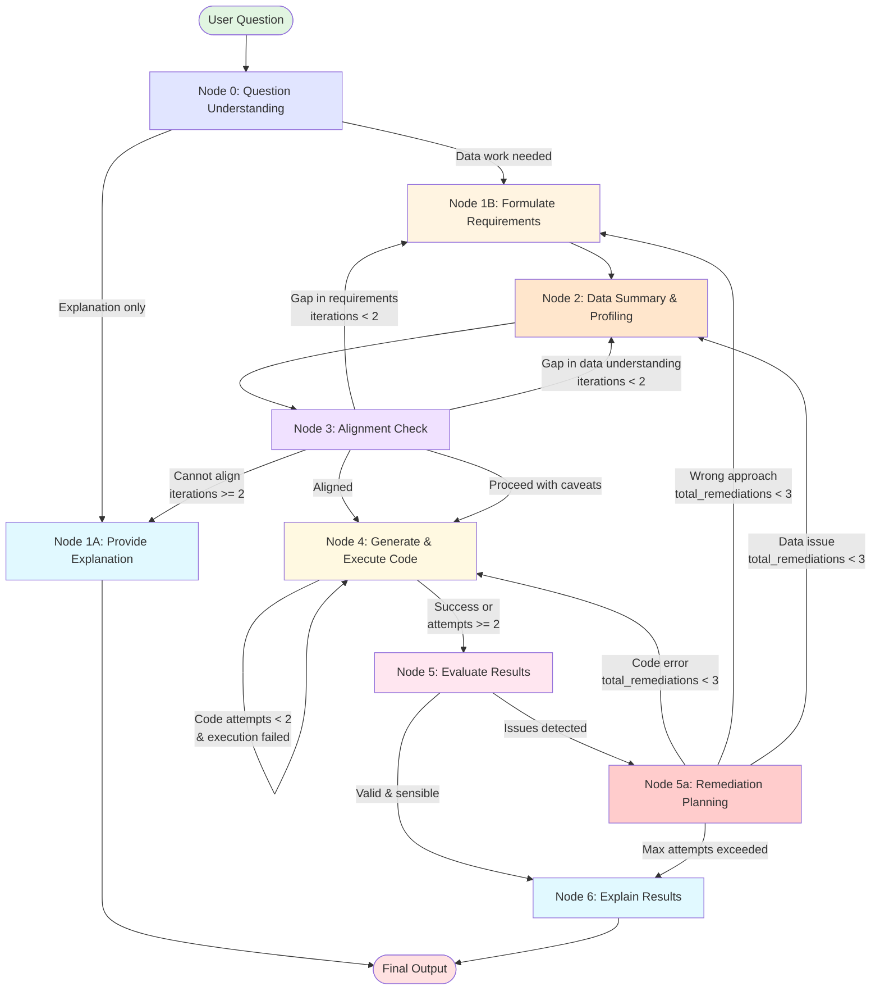

# MVP LangGraph Architecture - Robust Data Scientist Agent

**Created**: January 2, 2026  
**Status**: Finalized for Implementation  
**Version**: MVP 1.0

---

## Graph Structure



---

## Node Specifications

### **Node 0: Question Understanding**

**Purpose**: Determine if question needs explanation only or data work

**Inputs**:
- `question`: User's question
- `data_summary`: Available datasets summary

**LLM Prompt**:
```python
Analyze the user's question and determine if it requires data analysis or just conceptual explanation.

Examples:
- "What is a p-value?" → explanation_only
- "What's the average age?" → data_work
- "Show me age distribution" → data_work
- "Explain what correlation means" → explanation_only

Return JSON:
{
  "needs_data_work": true/false,
  "reasoning": "..."
}
```

**Outputs**:
- `needs_data_work`: boolean
- `reasoning`: string

**Routing**:
- If `needs_data_work = false` → **Node 1A**
- If `needs_data_work = true` → **Node 1B**

---

### **Node 1A: Provide Explanation**

**Purpose**: Answer conceptual/explanation questions or explain limitations

**Inputs**:
- `question`: User's question
- `data_summary`: Context (if relevant)
- `alignment_check`: Alignment issues (if coming from Node 3)

**LLM Prompt**:
```python
You are a data science educator explaining concepts to business users.

Question: {question}

Provide a clear, concise explanation using:
- Plain language suitable for non-technical audiences
- Concrete examples when helpful
- Practical context for business decisions

If this is explaining a limitation (data doesn't support the question):
- Clearly state what's missing
- Suggest alternatives if possible
```

**Outputs**:
- `explanation`: Final explanation text
- `final_output`: Complete output package

**Routing**: → **END**

---

### **Node 1B: Formulate Requirements**

**Purpose**: Define what's needed to answer the question

**Inputs**:
- `question`: User's question
- `data_summary`: Available datasets
- `remediation_plan`: Guidance from Node 5a (if retrying)

**LLM Prompt**:
```python
You are a data scientist planning an analysis. Define requirements to answer this question.

Question: {question}
Available Data: {data_summary}

Specify:
1. VARIABLES NEEDED: Which columns/features are required?
2. DATA CONSTRAINTS: What data quality is needed? (e.g., no missing values in X, Y must be numeric)
3. ANALYSIS APPROACH: What type of analysis? (descriptive stats, visualization, correlation, regression, etc.)
4. SUCCESS CRITERIA: What output would answer the question?

Return JSON:
{
  "variables_needed": ["col1", "col2", ...],
  "constraints": ["constraint1", "constraint2", ...],
  "analysis_type": "descriptive/visualization/correlation/regression/classification/...",
  "success_criteria": "what the output should contain",
  "reasoning": "why this approach"
}
```

**Outputs**:
- `requirements`: Dictionary with variables, constraints, analysis_type, success_criteria

**Routing**: → **Node 2**

---

### **Node 2: Data Summary & Profiling**

**Purpose**: Examine data to understand what's actually available using adaptive two-tier profiling

**Inputs**:
- `question`: User's question
- `requirements`: What we need (from Node 1B)
- `datasets`: Actual dataframes
- `remediation_plan`: Guidance from Node 5a (if retrying)

**Adaptive Profiling Strategy**:

Node 2 uses an intelligent two-tier approach that adapts based on dataset size:

**Small Datasets (≤30 columns)**:
- Generate **Summary B (Detailed Profile)** directly for all columns
- Includes: range, mean/std, unique count, top values, smart samples
- Smart sampling: head/middle/tail/rare values to detect format inconsistencies
- ~70 tokens per column

**Large Datasets (>30 columns)**:
1. **Step 1**: Generate **Summary A (Compact Overview)** for ALL columns
   - Ultra-compact: `column (dtype), unique=X, mean=Y, missing=Z%`
   - ~10 tokens per column
   - Gives LLM breadth to see entire dataset

2. **Step 2**: LLM selects relevant columns for detailed profiling (max 40)
   - Based on: required columns, missing data, numeric columns, ID/key columns
   - Uses `select_columns_for_profiling()` function

3. **Step 3**: Generate **Summary B (Detailed Profile)** for selected columns only
   - Same detailed format as small datasets
   - ~70 tokens per column

4. **Step 4**: Combine Summary A + Summary B for final profiling
   - LLM sees both breadth (all columns) and depth (selected columns)

**LLM Prompt (Final Profiling Step)**:
```python
You are examining the dataset(s) to profile what's available for this analysis.

You may receive data summaries in two formats:
1. DETAILED PROFILE ONLY: For small datasets, detailed profiles with samples and statistics
2. COMPACT + DETAILED: For large datasets:
   - COMPACT OVERVIEW: High-level summary of ALL columns
   - DETAILED PROFILE: In-depth analysis of selected relevant columns

Use the compact overview to understand the full dataset scope, and the detailed profile 
to assess data quality.

Question: {question}
Requirements: {requirements}
Dataset Summary: {data_summary}  # Either detailed-only or compact+detailed

Profile the data:
1. AVAILABLE COLUMNS: Which required columns exist? Check ALL datasets.
2. DATA QUALITY: Missing values, data types, value ranges, format issues
   - Use sample values to detect format inconsistencies (e.g., mixed date formats)
   - Use statistics to identify outliers or suspicious values
3. LIMITATIONS: What's missing or problematic?
4. SUITABILITY: Can this data support the required analysis?

Return JSON:
{
  "available_columns": ["col1", "col2", ...],
  "missing_columns": ["col3", ...],
  "data_quality": {
    "col1": "description of quality",
    "col2": "description of quality"
  },
  "limitations": ["limitation1", "limitation2", ...],
  "is_suitable": true/false,
  "reasoning": "..."
}
```

**Outputs**:
- `data_profile`: Dictionary with available columns, quality, limitations, suitability

**Token Budget**:
- Small datasets (30 cols): ~2,100 tokens
- Large datasets (100 cols): ~3,800 tokens (1000 for Summary A + 2800 for Summary B)
- Maximum safe for any dataset size

**Key Benefits**:
- Scalable to 100+ column datasets
- Smart sampling detects format inconsistencies (e.g., mixed date formats)
- LLM-driven column selection (not heuristics)
- Detailed quality assessment where it matters

**Routing**: → **Node 3**

---

### **Node 3: Alignment Check**

**Purpose**: Verify data can satisfy requirements; iterate if not. Supports "proceed with caveats" for cases where analysis is possible but has limitations.

**Inputs**:
- `requirements`: What we need
- `data_profile`: What we have
- `alignment_iterations`: Current iteration count

**LLM Prompt**:
```python
Check if the available data can satisfy the analysis requirements.

Requirements: {requirements}
Data Profile: {data_profile}

Determine:
1. ALIGNMENT: Does data satisfy requirements?
2. GAPS: What's missing or misaligned?
3. CAVEATS: Issues that don't block analysis but should be noted (e.g., "20% missing values - using complete cases")
4. RECOMMENDATION: What should we do?
   - "proceed" if fully aligned with no issues
   - "proceed_with_caveats" if analysis is possible but has limitations (e.g., missing data <30%, 
     data type issues that can be fixed, minor quality concerns). USE THIS when a human data scientist 
     would proceed with appropriate warnings rather than refusing.
   - "revise_requirements" if requirements are too strict/wrong
   - "revise_data_understanding" if we need to look at data differently
   - "cannot_proceed" if fundamentally incompatible (e.g., required column doesn't exist, >50% missing)

IMPORTANT: Prefer "proceed_with_caveats" over "cannot_proceed" when:
- Missing data is <30% (can use complete cases or imputation)
- Date formats are inconsistent (can be parsed/standardized)
- Data types need conversion (strings to numbers, Yes/No to 1/0)
- There are outliers or anomalies (can be handled in code)

Return JSON:
{
  "aligned": true/false,
  "gaps": ["gap1", "gap2", ...],
  "caveats": ["caveat1", "caveat2", ...],
  "recommendation": "proceed/proceed_with_caveats/revise_requirements/revise_data_understanding/cannot_proceed",
  "reasoning": "..."
}
```

**Outputs**:
- `alignment_check`: Dictionary with aligned status, gaps, caveats, recommendation
- `alignment_iterations`: Incremented counter

**Routing**:
- If `aligned = true` OR `recommendation = "proceed_with_caveats"` → **Node 4**
- If `recommendation = "revise_requirements"` AND `iterations < 2` → **Node 1B**
- If `recommendation = "revise_data_understanding"` AND `iterations < 2` → **Node 2**
- If `iterations >= 2` OR `recommendation = "cannot_proceed"` → **Node 1A** (explain limitation)

**Note**: When routing to Node 4 with caveats, the caveats are preserved in state and passed to Node 6 for inclusion in the final explanation.

---

### **Node 4: Generate & Execute Code**

**Purpose**: Write and run Python code to perform the analysis

**Inputs**:
- `question`: User's question
- `requirements`: Analysis requirements
- `data_profile`: Data context
- `datasets`: Actual dataframes
- `code_attempts`: Current attempt count
- `error`: Previous error (if retrying)
- `remediation_plan`: Guidance from Node 5a (if retrying)

**LLM Prompt (First Attempt)**:
```python
You are an expert data analyst writing Python code to answer this question.

Question: {question}
Requirements: {requirements}
Data Profile: {data_profile}

Write clean, executable Python code using pandas, numpy, and Plotly.

CODE REQUIREMENTS:
- Access datasets using: datasets['dataset_id'] or df (for single dataset)
- Libraries pre-imported: pd, np, plt, px, go, make_subplots, sklearn, scipy, statsmodels
- For visualizations: Store figure in variable 'fig'
- For analysis: Store result in variable 'result'
- Use Plotly for visualizations (plotly_white template)
- Perform actual calculations, never hardcode results

Return ONLY the Python code, no explanations or markdown.
```

**LLM Prompt (Retry)**:
```python
Fix the code that failed with this error.

Question: {question}
Previous Code: {code}
Error: {error}
Remediation Guidance: {remediation_plan}

Analyze the error and generate CORRECTED code.

Return ONLY the fixed Python code, no explanations.
```

**Execution**: Via `code_executor.py:execute_unified_code()`

**Outputs**:
- `code`: Generated/fixed code
- `execution_result`: Output dictionary
- `execution_success`: Boolean
- `error`: Error message (if failed)
- `code_attempts`: Incremented counter

**Routing**:
- If `execution_success = true` → **Node 5**
- If `execution_success = false` AND `code_attempts < 2` → **Node 4** (retry)
- If `execution_success = false` AND `code_attempts >= 2` → **Node 5** (evaluate failure)

---

### **Node 5: Evaluate Results**

**Purpose**: Validate if results are correct and make sense

**Inputs**:
- `question`: User's question
- `requirements`: What we were trying to achieve
- `code`: Executed code
- `execution_result`: Code output
- `execution_success`: Whether code ran
- `error`: Error message (if failed)

**LLM Prompt**:
```python
Evaluate the analysis results for correctness and sensibility.

Question: {question}
Requirements: {requirements}
Code: {code}
Execution Success: {execution_success}
Results: {execution_result}
Error: {error}

Validate:
1. PLAUSIBILITY: Are numbers reasonable? Any impossible values (e.g., correlation > 1)?
2. METHODOLOGY: Was the approach appropriate for the question?
3. COMPLETENESS: Did this actually answer the question?
4. ISSUES: Any errors, red flags, or concerns?

Return JSON:
{
  "is_valid": true/false,
  "issues_found": ["issue1", "issue2", ...],
  "confidence": 0.0-1.0,
  "recommendation": "accept/code_error/wrong_approach/data_issue",
  "reasoning": "..."
}
```

**Outputs**:
- `evaluation`: Dictionary with validity, issues, confidence, recommendation

**Routing**:
- If `is_valid = true` → **Node 6**
- If `is_valid = false` → **Node 5a**

---

### **Node 5a: Remediation Planning**

**Purpose**: Determine root cause and which node to revisit

**Inputs**:
- `question`: User's question
- `evaluation`: Issues identified
- `code`: Current code
- `error`: Error message
- `requirements`: Current requirements
- `data_profile`: Current data understanding
- `total_remediations`: Global counter

**LLM Prompt**:
```python
Determine the root cause of the issue and plan remediation.

Question: {question}
Evaluation Issues: {evaluation}
Code: {code}
Error: {error}

Diagnose:
1. ROOT CAUSE: What's the fundamental problem?
2. ACTION: What should we do?
   - "rewrite_code": Code has bugs or wrong implementation
   - "revise_requirements": We're approaching the problem wrong
   - "reexamine_data": We misunderstood the data structure/quality

Return JSON:
{
  "root_cause": "description",
  "action": "rewrite_code/revise_requirements/reexamine_data",
  "guidance": "specific instructions for the target node",
  "reasoning": "..."
}
```

**Outputs**:
- `remediation_plan`: Dictionary with root_cause, action, guidance
- `total_remediations`: Incremented global counter

**Routing**:
- If `total_remediations >= 3` → **Node 6** (give up gracefully)
- If `action = "rewrite_code"` → **Node 4**
- If `action = "revise_requirements"` → **Node 1B**
- If `action = "reexamine_data"` → **Node 2**

---

### **Node 6: Explain Results**

**Purpose**: Communicate findings to user in plain language, including any data quality caveats from Node 3

**Inputs**:
- `question`: User's question
- `evaluation`: Analysis evaluation
- `execution_result`: Code output
- `code`: Executed code
- `requirements`: Analysis requirements
- `alignment_caveats`: Data quality caveats from Node 3 (if any)

**LLM Prompt**:
```python
Explain the analysis results to a business user.

Question: {question}
Evaluation: {evaluation}
Results: {execution_result}
Remediation Attempts: {total_remediations}
Max Attempts Exceeded: {max_attempts_exceeded}
Data Quality Caveats: {alignment_caveats}  # From Node 3, if proceed_with_caveats was used

Provide:
1. DIRECT ANSWER: Clear answer to the user's question (or explain what went wrong)
2. KEY FINDINGS: Main insights from the analysis (if successful)
3. CONTEXT: What the numbers mean in practical terms
4. CAVEATS: Any limitations or concerns - IMPORTANT: If Data Quality Caveats are provided, 
   you MUST include them prominently so the user understands the limitations of the analysis.

If max remediation attempts were exceeded:
- Clearly explain what error occurred
- Describe what we tried to fix it
- Suggest how the user might help resolve it (e.g., clarify question, check data quality)

Use plain language suitable for non-technical audiences.
Be concise but thorough.
```

**Outputs**:
- `explanation`: Final user-facing explanation
- `final_output`: Complete output package with:
  - `explanation`
  - `evaluation`
  - `code`
  - `requirements`
  - `alignment_caveats`: Caveats from Node 3 (for transparency)
  - `output_type`: "visualization", "analysis", "error", or "explanation"
  - `figures`: Plotly figures (if visualization)
  - `result_str`: Raw execution output

**Routing**: → **END**

---

## State Schema

```python
class MVPAgentState(TypedDict):
    # Input
    question: str
    datasets: dict  # {dataset_id: {name, df, data_summary, ...}}
    data_summary: str
    messages: list
    
    # Node 0
    needs_data_work: bool
    
    # Node 1B
    requirements: Optional[dict]  # {variables_needed, constraints, analysis_type, success_criteria}
    
    # Node 2
    data_profile: Optional[dict]  # {available_columns, data_quality, limitations, is_suitable}
    
    # Node 3
    alignment_check: Optional[dict]  # {aligned, gaps, caveats, recommendation}
    alignment_iterations: int  # Max 2
    
    # Node 4
    code: Optional[str]
    execution_result: Optional[dict]
    execution_success: bool
    error: Optional[str]
    code_attempts: int  # Max 2
    
    # Node 5
    evaluation: Optional[dict]  # {is_valid, issues_found, confidence, recommendation}
    
    # Node 5a
    remediation_plan: Optional[dict]  # {root_cause, action, guidance}
    total_remediations: int  # Max 3 (global counter)
    
    # Node 6
    explanation: str
    final_output: dict
```

---

## Routing Functions

```python
def route_from_node_0(state):
    """Route from question understanding"""
    if not state["needs_data_work"]:
        return "node_1a_explain"
    else:
        return "node_1b_requirements"

def route_from_node_3(state):
    """Route from alignment check"""
    alignment = state["alignment_check"]
    recommendation = alignment.get("recommendation", "")
    
    # Proceed if aligned OR if we can proceed with caveats
    if alignment["aligned"] or recommendation == "proceed_with_caveats":
        return "node_4_code"
    elif state["alignment_iterations"] >= 2 or recommendation == "cannot_proceed":
        return "node_1a_explain_limitation"
    elif recommendation == "revise_requirements":
        return "node_1b_requirements"
    else:  # revise_data_understanding
        return "node_2_data"

def route_from_node_4(state):
    """Route from code execution"""
    if state["execution_success"] or state["code_attempts"] >= 2:
        return "node_5_evaluate"
    else:
        return "node_4_code"  # Retry

def route_from_node_5(state):
    """Route from evaluation"""
    if state["evaluation"]["is_valid"]:
        return "node_6_explain"
    else:
        return "node_5a_remediation"

def route_from_node_5a(state):
    """Route from remediation planning"""
    if state["total_remediations"] >= 3:
        return "node_6_explain"  # Give up gracefully
    
    action = state["remediation_plan"]["action"]
    if action == "rewrite_code":
        return "node_4_code"
    elif action == "revise_requirements":
        return "node_1b_requirements"
    else:  # reexamine_data
        return "node_2_data"
```

---

## Loop Limits Summary

| Loop | Max Iterations | Behavior When Exceeded |
|------|----------------|------------------------|
| **Alignment Loop** (Node 3 ↔ 1B/2) | 2 | Route to Node 1A (explain limitation) |
| **Code Retry** (Node 4 → 4) | 2 | Proceed to Node 5 with failure |
| **Remediation Loop** (Node 5a → 1B/2/4) | 3 total | Route to Node 6 (explain with caveats) |

---

## Example Execution Flows

### Example 1: Simple Success Path
```python
User: "What's the average customer age?"
  ↓
Node 0 → needs_data_work=true, num_subtasks=1
  ↓
Node 1B → requirements: {variables: ["age"], analysis_type: "descriptive"}
  ↓
Node 2 → data_profile: {available: ["age"], quality: "good"}
  ↓
Node 3 → aligned=true
  ↓
Node 4 → code executes successfully: mean = 42.3
  ↓
Node 5 → is_valid=true (reasonable value)
  ↓
Node 6 → "The average customer age is 42.3 years..."
  ↓
END
```

### Example 2: Alignment Loop
```python
User: "Show correlation between satisfaction and revenue"
  ↓
Node 0 → needs_data_work=true
  ↓
Node 1B → requirements: {variables: ["satisfaction", "revenue"], analysis_type: "correlation"}
  ↓
Node 2 → data_profile: {available: ["satisfaction"], missing: ["revenue"]}
  ↓
Node 3 → aligned=false, recommendation="revise_requirements" (iteration 1)
  ↓
Node 1B → requirements: {variables: ["satisfaction", "sales"], analysis_type: "correlation"}
  ↓
Node 2 → (reuses existing profile)
  ↓
Node 3 → aligned=true
  ↓
[Continue to Node 4...]
```

### Example 3: Remediation Loop
```python
User: "Calculate correlation between age and income"
  ↓
[Nodes 0-3 succeed]
  ↓
Node 4 → code executes: correlation = 1.2
  ↓
Node 5 → is_valid=false (correlation > 1 is impossible!)
  ↓
Node 5a → root_cause="calculation error", action="rewrite_code" (remediation 1)
  ↓
Node 4 → fixed code executes: correlation = 0.72
  ↓
Node 5 → is_valid=true
  ↓
Node 6 → Explain results
  ↓
END
```

### Example 4: Conceptual Question
```python
User: "What is a p-value?"
  ↓
Node 0 → needs_data_work=false
  ↓
Node 1A → Explain p-value concept
  ↓
END
```

### Example 5: Max Remediation Attempts Exceeded
```python
User: "Calculate the trend coefficient"
  ↓
[Nodes 0-3 succeed]
  ↓
Node 4 → code fails (unclear what "trend coefficient" means)
  ↓
Node 5 → is_valid=false
  ↓
Node 5a → action="revise_requirements" (remediation 1)
  ↓
Node 1B → tries to interpret "trend coefficient"
  ↓
[Loop continues through attempts 2 and 3, still unclear]
  ↓
Node 5a → total_remediations=3 (max exceeded)
  ↓
Node 6 → Explain: "I attempted to calculate the trend coefficient but 
         encountered ambiguity. 'Trend coefficient' could refer to:
         - Linear regression slope
         - Time series trend parameter
         - Correlation with time
         Could you clarify which analysis you'd like?"
  ↓
END
```
