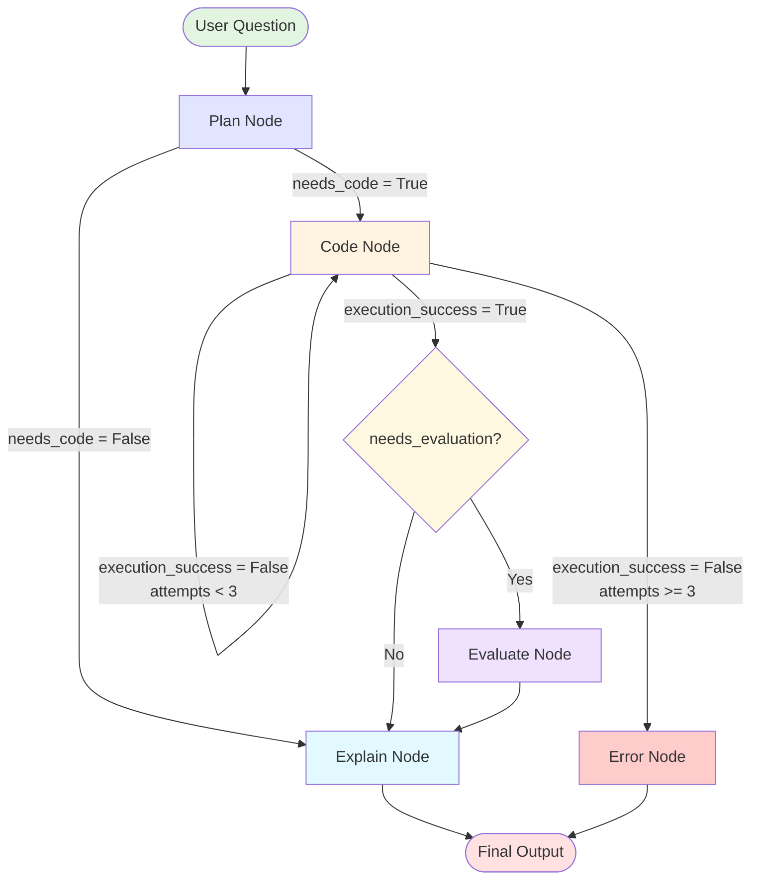

# LangGraph Agent Architecture

## Overview
This document visualizes the LangGraph workflow for the AI Data Scientist agent. Use this as a reference when modifying the agent logic.

---

## Graph Structure



---

## Node Details

### 1️⃣ **Plan Node**
**File**: `langgraph_agent.py:30-40`  
**Function**: `plan_node(state: AgentState)`

**Purpose**: Analyzes the user's question and determines the execution strategy.

**Inputs**:
- `question`: User's question
- `data_summary`: Combined dataset summaries
- `messages`: Chat history

**LLM Prompt** (from `llm_client.py:create_execution_plan`):
```
You are a data analysis planning assistant. Your job is to analyze user questions and determine the best approach to answer them.

You have access to these steps:
- Step 2: CODE - Write Python code to analyze data or create visualizations
- Step 3: EVALUATION - Examine code results and interpret findings
- Step 4: EXPLANATION - Provide a high-level answer to the user

Your task is to decide which steps are needed for the given question.

IMPORTANT RULES:
- Step 3 (EVALUATION) can only run if Step 2 (CODE) runs
- Step 4 (EXPLANATION) should almost always run (unless the code output is self-explanatory)
- For conceptual questions, skip code and evaluation
- For data questions, use code to get actual results (never guess)
- Code is stateless - previous data transformations must be regenerated if needed

EXAMPLES:

Question: "What is correlation?"
Plan: needs_code=false, needs_evaluation=false, needs_explanation=true
Reasoning: Conceptual question, no data analysis needed

Question: "Show me a histogram of ages"
Plan: needs_code=true, needs_evaluation=false, needs_explanation=true
Reasoning: Need code to create visualization, explanation describes what it shows

Question: "Does the data have collinearity issues?"
Plan: needs_code=true, needs_evaluation=true, needs_explanation=true
Reasoning: Need code to calculate correlations, evaluation to interpret values, explanation to answer question

Question: "What's the average salary?"
Plan: needs_code=true, needs_evaluation=false, needs_explanation=true
Reasoning: Need code to calculate, explanation to present result in context

Question: "Calculate the mean and tell me if it's unusually high"
Plan: needs_code=true, needs_evaluation=true, needs_explanation=true
Reasoning: Need code to calculate, evaluation to assess if high, explanation to answer

Return your response as JSON:
{
  "needs_code": true/false,
  "needs_evaluation": true/false,
  "needs_explanation": true/false,
  "reasoning": "brief explanation"
}
```

**Outputs**:
- `plan`: Dictionary containing:
  - `reasoning`: Why this approach was chosen
  - `needs_code`: Boolean - requires code generation?
  - `needs_evaluation`: Boolean - requires critical evaluation?
  - `needs_explanation`: Boolean - requires final explanation?

**Routing Logic**:
- If `needs_code = True` → Go to **Code Node**
- If `needs_code = False` → Go to **Explain Node** (conceptual question)

---

### 2️⃣ **Code Node**
**File**: `langgraph_agent.py:43-77`  
**Function**: `code_node(state: AgentState)`

**Purpose**: Generates Python code, executes it, and handles retries on failure.

**Inputs**:
- `question`: User's question
- `data_summary`: Dataset context
- `datasets`: Actual dataframes for execution
- `attempts`: Current retry count (0-3)
- `code`: Previous code (if retrying)
- `error`: Previous error (if retrying)

**LLM Prompts**:

**First Attempt** (`llm_client.py:generate_unified_code`):
```
You are an expert data analyst who writes Python code to answer questions.

Your job is to write clean, executable Python code using pandas, numpy, and Plotly.

IMPORTANT CODE REQUIREMENTS:
- Access datasets using the 'datasets' dictionary: datasets['dataset_id']
- For single dataset scenarios, 'df' is also available for backward compatibility
- Import statements NOT needed (pd, np, plt, px, go, make_subplots already imported)
- Available libraries: sklearn, scipy, statsmodels (sm, smf), seaborn (sns)
- For visualizations: Store the final figure in a variable called 'fig'
- For analysis: Store the final result in a variable called 'result'
- Code is stateless - if you need previous transformations, regenerate them
- You can reference previous code from chat history and reuse patterns

CRITICAL: DATAFRAME OPERATIONS & VARIABLE SCOPE
- When you add a column to a DataFrame, that column only exists in that specific DataFrame object
- If you create subsets (e.g., treatment_data = data[data['col'] == value]), those subsets are COPIES
- Columns added to the parent DataFrame AFTER creating subsets will NOT appear in the subsets
- ALWAYS add all derived columns BEFORE splitting data into subsets

VISUALIZATION GUIDELINES:
- Use Plotly (px for simple charts, go for complex ones)
- Use make_subplots for multiple plots
- Set proper titles, labels, and templates (plotly_white)
- Store final figure in 'fig'

ANALYSIS GUIDELINES:
- Perform actual calculations, never hardcode results
- Store final result in 'result' variable
- Result can be a value, string, dataframe, or dictionary

Return ONLY the Python code, no explanations or markdown.
```

**Retry Attempt** (`llm_client.py:fix_code_with_error`):
```
You are an expert data analyst who fixes broken Python code.

Your job is to analyze the error and generate CORRECTED code that will execute successfully.

IMPORTANT CODE REQUIREMENTS:
- Access datasets using the 'datasets' dictionary: datasets['dataset_id']
- For single dataset scenarios, 'df' is also available for backward compatibility
- Import statements NOT needed (pd, np, plt, px, go, make_subplots already imported)
- Available libraries: sklearn, scipy, statsmodels (sm, smf), seaborn (sns)
- For visualizations: Store the final figure in a variable called 'fig'
- For analysis: Store the final result in a variable called 'result'

COMMON ERROR PATTERNS:
1. KeyError/Column not found: Check if column exists in the DataFrame at that point in execution
2. NameError: Variable used before definition or out of scope
3. AttributeError: Method doesn't exist or wrong object type
4. ValueError: Data type mismatch or invalid operation

FIXING STRATEGY:
1. Read the error message carefully to identify the root cause
2. Trace through the code to find where the issue occurs
3. Fix the specific issue without changing working parts
4. Ensure the fix maintains the original intent of the code

Return ONLY the FIXED Python code, no explanations or markdown.
```

**Execution**: Code is executed in a sandboxed environment via `code_executor.py:execute_unified_code()`

**Outputs**:
- `code`: Generated/fixed Python code
- `execution_result`: Output dict (type, figures, result_str)
- `execution_success`: Boolean
- `error`: Error message (if failed)
- `attempts`: Incremented counter
- `failed_attempts`: List of failed attempts with code + error

**Routing Logic**:
- If `execution_success = True` → Check if evaluation needed
- If `execution_success = False` AND `attempts < 3` → **Retry** (loop back to Code Node)
- If `execution_success = False` AND `attempts >= 3` → Go to **Error Node**

---

### 3️⃣ **Evaluate Node**
**File**: `langgraph_agent.py:80-92`  
**Function**: `evaluate_node(state: AgentState)`

**Purpose**: Critically evaluates the code execution results for correctness and insights.

**Inputs**:
- `question`: User's question
- `code`: Executed code
- `execution_result.result_str`: Code output
- `data_summary`: Dataset context

**LLM Prompt** (from `llm_client.py:evaluate_code_results`):
```
You are a data analysis expert who evaluates code results and interprets findings.

Your job is to:
1. Examine the actual output from code execution
2. Identify patterns, insights, or issues
3. Provide objective interpretation based on the data
4. Be specific and grounded in actual results

CRITICAL RULES:
- ONLY discuss what you see in the actual output
- NEVER make up data or hallucinate findings
- Be specific with numbers and values
- Identify trends, outliers, or notable patterns
- Keep it concise and factual

This evaluation will be used to create the final explanation for the user.
```

**Outputs**:
- `evaluation`: Critical analysis of results

**Routing Logic**:
- Always → Go to **Explain Node**

---

### 4️⃣ **Explain Node**
**File**: `langgraph_agent.py:95-127`  
**Function**: `explain_node(state: AgentState)`

**Purpose**: Generates user-friendly explanation of results.

**Inputs**:
- `question`: User's question
- `evaluation`: Critical evaluation (if available)
- `data_summary`: Dataset context

**LLM Prompt** (from `llm_client.py:generate_final_explanation`):
```
You are a data science communicator who explains findings to business users.

Your job is to:
1. Provide a clear, high-level answer to the user's question
2. Use plain language suitable for non-technical audiences
3. Synthesize findings from the evaluation (if provided)
4. Be concise but thorough

Keep your explanation focused and actionable.
```

**Outputs**:
- `explanation`: Final user-facing explanation
- `final_output`: Complete output package containing:
  - `explanation`
  - `evaluation`
  - `code`
  - `plan`
  - `output_type`: "visualization", "analysis", or None
  - `figures`: Plotly/matplotlib figures (if visualization)
  - `result_str`: Raw execution output
  - `failed_attempts`: List of failed attempts

**Routing Logic**:
- Always → **END**

---

### 5️⃣ **Error Node**
**File**: `langgraph_agent.py:130-149`  
**Function**: `error_node(state: AgentState)`

**Purpose**: Handles max retry failures gracefully.

**Inputs**:
- `attempts`: Final attempt count (should be 3)
- `error`: Last error message
- `code`: Last attempted code
- `failed_attempts`: All failed attempts

**No LLM Prompt** - Uses template error message:
```
"Code execution failed after {attempts} attempts. Final error: {error}"
```

**Outputs**:
- `explanation`: Error message for user
- `final_output`: Error package with:
  - `output_type`: "error"
  - `error`: Error details
  - `failed_attempts`: All retry attempts

**Routing Logic**:
- Always → **END**

---

## Conditional Edges (Routing Functions)

### `should_execute_code(state)`
**File**: `langgraph_agent.py:152-156`

```python
if state["plan"]["needs_code"]:
    return "code"
else:
    return "explain"
```

### `should_retry_code(state)`
**File**: `langgraph_agent.py:159-165`

```python
if state["execution_success"]:
    return "evaluate"
elif state["attempts"] < 3:
    return "retry"  # Loop back to code node
else:
    return "error"
```

### `should_evaluate(state)`
**File**: `langgraph_agent.py:168-172`

```python
if state["plan"]["needs_evaluation"]:
    return "evaluate"
else:
    return "explain"
```

---

## State Schema

**File**: `langgraph_agent.py:13-27`

```python
class AgentState(TypedDict):
    # Input
    question: str              # User's question
    datasets: dict             # {dataset_id: {name, df, data_summary, ...}}
    data_summary: str          # Combined summary of all datasets
    messages: list             # Chat history
    
    # Workflow state
    plan: Optional[dict]       # Execution plan from plan_node
    code: Optional[str]        # Generated/fixed code
    execution_result: Optional[dict]  # {type, figures, result_str}
    execution_success: bool    # Did code execute successfully?
    error: Optional[str]       # Error message (if failed)
    attempts: int              # Retry counter (0-3)
    failed_attempts: list      # [{attempt, code, error}, ...]
    
    # Output
    evaluation: Optional[str]  # Critical evaluation
    explanation: Optional[str] # Final explanation
    final_output: Optional[dict]  # Complete output package
```

---

## Execution Flow Examples

### Example 1: Simple Analysis (Success on First Try)
```
User: "What's the average age?"
  ↓
Plan Node → needs_code=True, needs_evaluation=True
  ↓
Code Node (attempt 1) → SUCCESS
  ↓
Evaluate Node → Critical analysis
  ↓
Explain Node → User-friendly answer
  ↓
END
```

### Example 2: Visualization (No Evaluation Needed)
```
User: "Show me a histogram of ages"
  ↓
Plan Node → needs_code=True, needs_evaluation=False
  ↓
Code Node (attempt 1) → SUCCESS (figures generated)
  ↓
Explain Node → Describe the visualization
  ↓
END
```

### Example 3: Code Retry (Fails Twice, Succeeds on Third)
```
User: "Calculate correlation between X and Y"
  ↓
Plan Node → needs_code=True, needs_evaluation=True
  ↓
Code Node (attempt 1) → FAIL (syntax error)
  ↓ (retry)
Code Node (attempt 2) → FAIL (wrong column name)
  ↓ (retry)
Code Node (attempt 3) → SUCCESS
  ↓
Evaluate Node → Critical analysis
  ↓
Explain Node → Answer with retry context
  ↓
END
```

### Example 4: Max Retries Exceeded
```
User: "Do something impossible"
  ↓
Plan Node → needs_code=True
  ↓
Code Node (attempt 1) → FAIL
  ↓ (retry)
Code Node (attempt 2) → FAIL
  ↓ (retry)
Code Node (attempt 3) → FAIL
  ↓
Error Node → Explain failure to user
  ↓
END
```

### Example 5: Conceptual Question (No Code)
```
User: "What is a p-value?"
  ↓
Plan Node → needs_code=False, needs_explanation=True
  ↓
Explain Node → Conceptual explanation
  ↓
END
```

---

## Key Files Reference

| File | Purpose |
|------|---------|
| `langgraph_agent.py` | Graph definition, nodes, routing logic |
| `llm_client.py` | LLM calls (planning, code gen, evaluation, explanation) |
| `code_executor.py` | Safe code execution sandbox |
| `data_analyzer.py` | Dataset summary generation |
| `supabase_logger.py` | Persistent logging |

---

**Last Updated**: January 1, 2026  
**Graph Version**: 1.0 (Initial LangGraph Migration)
